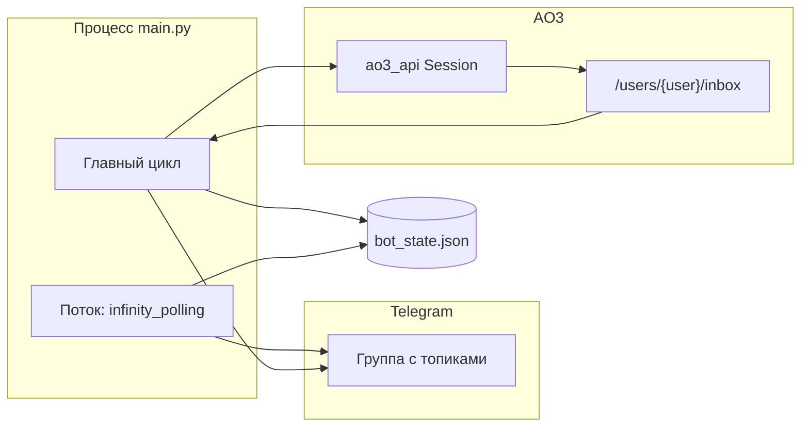

# AO3 Comment Monitor Bot (WTF-bot)

Telegram-бот следит за **Inbox** аккаунта [Archive of Our Own](https://archiveofourown.org/) (AO3) и рассылает уведомления о **новых комментариях** в выбранные топики Telegram-групп. Источник данных — одна страница Inbox за цикл (не обход всех работ).

---

## Структура репозитория

```
WTF-bot/
├── main.py              # Точка входа: конфиг, поток polling Telegram, цикл проверки AO3
├── config.py            # Загрузка настроек: .env + config.ini в каталоге проекта (и переменные процесса)
├── bot_client.py        # Telegram: команды, админ в ЛС, my_chat_member, уведомления
├── host_status.py       # Метрики VPS для отчёта глобальному админу (HTML)
├── ao3_parser.py        # AO3: сессия (ao3_api), загрузка Inbox, BeautifulSoup-парсинг
├── state_manager.py     # JSON-состояние: известные комментарии, список топиков
├── utils.py             # Хеш комментария, задержки с jitter, логирование, escape HTML
├── requirements.txt
├── runtime.txt
├── Procfile
├── config.ini.example
├── .env.example         # Пример переменных окружения (скопировать в .env при желании)
├── bot_state.json       # Создаётся автоматически (в .gitignore; шаблон без данных — bot_state.json.example)
├── docs/
│   ├── PLANNED_ARCHITECTURE.md
│   └── from-zero-ru.md  # С нуля: VPS, прокси, конфиг, порядок чтения кода
├── .gitignore
└── README.md
```

При отладке парсера AO3 могут появляться файлы **`ao3_inbox_last.html`** и **`ao3_last_page.html`** (не коммитятся по смыслу — временный дамп ответа сервера).

---

## Архитектура

### Общая схема



1. **`main.py`** после загрузки конфига поднимает **`bot_client`** в **отдельном потоке** (daemon): long polling для команд Telegram.
2. В **основном потоке** один раз создаётся авторизованная сессия AO3 (`ao3_parser.create_ao3_session`), затем бесконечный цикл:
   - перечитать `bot_state.json`;
   - с задержкой и повторами загрузить HTML Inbox;
   - распарсить только блоки комментариев (`notification_type == "comment"`);
   - при первом запуске (`initial_seed_done == false`) запомнить все текущие комментарии **без отправки** в Telegram;
   - иначе для каждого нового комментария отправить сообщение во **все** подписанные пары `(chat_id, message_thread_id)` с паузой между отправками;
   - атомарно сохранить состояние.

### Модули и ответственность

| Модуль | Роль |
|--------|------|
| **`config.py`** | Один каталог проекта: автоматически читается `.env` (если есть), затем `config.ini`; непустые переменные процесса перекрывают оба. Обязательны `BOT_TOKEN`, `AO3_USERNAME`, `AO3_PASSWORD`. |
| **`state_manager.py`** | `known_comments` по `work_id`, список **`notification_targets`**, флаг `initial_seed_done`, миграция со старого одиночного `notification_target`. |
| **`ao3_parser.py`** | Логин через **ao3_api** (`AO3.Session`), GET Inbox через эту сессию, разбор `ol.comment.index.group`, нормализация дат в МСК, retry при 5xx/таймаутах. Содержит также код для списка работ и комментариев со страниц работ — для основного режима **не используется** (остался как расширяемая/legacy-часть). |
| **`bot_client.py`** | `TeleBot`, контекст `BotRuntimeContext`, подписки на топики, **`my_chat_member`** (снятие подписок при кике), глобальный админ в ЛС (`/status`, `/topics`), периодический отчёт по VPS. |
| **`host_status.py`** | Сбор метрик хоста (RAM, диск, loadavg; при наличии **psutil** — CPU и RSS процесса), HTML для Telegram. |
| **`utils.py`** | `comment_hash`, `safe_delay` (jitter), `setup_logging`, `escape_html`. |
| **`main.py`** | Склейка потоков, цикл проверки, фильтрация только комментариев из Inbox, обработка ошибок цикла с паузой `ERROR_PAUSE_SECONDS`. |

### Потоки и состояние

- **Гонки**: основной цикл периодически **перезагружает** состояние с диска перед отправкой, чтобы подхватить `/notify_here` или `/set_topic`, выполненные во время долгого парсинга.
- **Идемпотентность**: новый комментарий добавляется в `known_comments` только если отправка **хотя бы в один** топик прошла успешно (`sent_any`).

### Данные в `bot_state.json` (логически)

- `tracked_user` — синхронизируется с конфигом при старте цикла.
- `last_check_timestamp` — время последнего успешного прохода сохранения.
- `known_comments` — словарь `work_id → [id или хеш, ...]`.
- `notification_targets` — `[{ "chat_id", "message_thread_id" }, ...]`.
- `initial_seed_done` — после первого «холостого» прогона без уведомлений.

---

## Требования

- **Python**: для локальной разработки достаточно **3.9+**; в `runtime.txt` зафиксировано **3.11.7** под деплой (Railway и аналоги).
- **Сеть**: исходящий HTTPS к `archiveofourown.org` и API Telegram.
- **Telegram**: токен бота ([@BotFather](https://t.me/BotFather)), группа (желательно супергруппа с **топиками** для привязки ветки).
- **AO3**: учётная запись того же пользователя, за чьим **Inbox** нужно следить; имя пользователя AO3 (не email в поле логина конфига — в коде ожидается username сайта).

### Зависимости (`requirements.txt`)

| Пакет | Назначение |
|-------|------------|
| `python-dotenv` | Автозагрузка `.env` из каталога проекта при старте |
| `requests` | HTTP (в т.ч. внутри ao3_api и вспомогательные запросы модуля парсера) |
| `beautifulsoup4` | Разбор HTML Inbox |
| `pyTelegramBotAPI` | Telegram Bot API |
| `ao3_api` | Авторизованная сессия AO3 для доступа к Inbox |
| `psutil` | Опционально усиливает отчёт VPS (CPU, RSS); без него на Linux частично доступны `/proc` и loadavg |

Без успешного импорта и логина через **ao3_api** бот завершится с ошибкой при старте (режим только Inbox).

---

## Конфигурация

Пошаговое объяснение типичных проблем (VPS, прокси, bash, Git), порядок чтения кода и **темы для самостоятельного изучения** (сеть, TLS, прокси, systemd) — в **[`docs/from-zero-ru.md`](docs/from-zero-ru.md)**.

Все параметры задаются **в каталоге проекта** (рядом с `main.py`): основной файл **`config.ini`** (шаблон [`config.ini.example`](config.ini.example)) и/или **`.env`** (шаблон [`.env.example`](.env.example)). Файл `.env` подхватывается **автоматически** при старте (`python-dotenv`), без ручного `export`.

**Порядок приоритета:** непустая переменная окружения процесса (systemd, Railway, `export`) → ключ из `.env` → ключ из `config.ini`. Пустая строка в окружении не считается заданным значением (удобно для шаблонов unit-файлов).

На проде можно держать только `config.ini`, только `.env`, или разделить (например секреты в `.env`, остальное в INI).

### Файл `config.ini`

Секции **`[TELEGRAM]`**, **`[AO3]`**, **`[ADMIN]`** (опционально), **`[APP]`**. В **`[TELEGRAM]`** для доступа к Bot API через локальный sing-box: `PROXY_URL = socks5://127.0.0.1:1234`. В **`[ADMIN]`** для таймерных ЛС-отчётов задайте **`TELEGRAM_USER_ID`** (число) — надёжнее, чем только username, если `getChat` по `@username` недоступен.

### Переменные (те же имени в `.env`, в панели хостинга или в shell)

| Переменная | Описание |
|------------|----------|
| `BOT_TOKEN` | Токен Telegram-бота |
| `AO3_USERNAME` | Имя пользователя AO3 |
| `AO3_PASSWORD` | Пароль AO3 |
| `CHECK_INTERVAL` | Интервал между полными циклами проверки (секунды; по умолчанию из INI или 180) |
| `REQUEST_DELAY` | Базовая задержка между запросами к AO3 / jitter (секунды; без INI по умолчанию **15**) |
| `STATE_FILE` | Путь к JSON состояния (по умолчанию `bot_state.json`) |
| `LOG_FILE` | Путь к файлу логов или пусто — только консоль |
| `ADMIN_TELEGRAM_USERNAME` | Username глобального админа **без @** (ЛС: `/status`, `/topics`; им должна быть разрешена переписка с ботом) |
| `ADMIN_TELEGRAM_USER_ID` | Числовой Telegram user id админа (если задан, надёжнее username) |
| `ADMIN_STATUS_INTERVAL` | Интервал авто-отчёта о VPS в ЛС админу (секунды). **`0`** — не слать по таймеру (остаётся ручной `/status`) |
| `TELEGRAM_PROXY_URL` | Прокси **только для Telegram Bot API** (`socks5h://…`, `socks5://…`, `http://…`). AO3 запросы прокси не используют. Нужен `PySocks` для SOCKS (в `requirements.txt`) |

### Если с VPS не открывается api.telegram.org

Задайте **`TELEGRAM_PROXY_URL`**: адрес SOCKS5 или HTTP из ЛК VPN-провайдера (если они выдают прокси), или свой прокси на сервере за рубежом. На потребительском VPN без выданного прокси обычно ставят клиент на ПК, а на VPS — отдельный выход (прокси-хостинг или маленький зарубежный VPS с `dante`/`3proxy`).

---

## Глобальный админ и VPS

- В **личку** боту с аккаунта, совпадающего с `ADMIN_TELEGRAM_USERNAME` или `ADMIN_TELEGRAM_USER_ID`: **`/status`** — снимок нагрузки (CPU/RAM/диск/uptime, число подписок); **`/topics`** — список всех `chat_id` / thread для уведомлений с названиями чатов (если API доступен).
- Если задан **`ADMIN_STATUS_INTERVAL` > 0** и удалось определить chat id админа, тот же отчёт отправляется **периодически** (отдельный поток).
- При **исключении бота из группы** все подписки для этого `chat_id` удаляются из `bot_state.json`; в ЛС админу уходит короткое уведомление (если админ настроен).

---

## Установка и запуск (локально)

```bash
python -m venv venv
venv\Scripts\activate
pip install -r requirements.txt
copy config.ini.example config.ini
# Отредактировать config.ini или задать BOT_TOKEN, AO3_USERNAME, AO3_PASSWORD в окружении
python main.py
```

### Команды в группе (только **администраторы** этой группы)

| Команда | Действие |
|---------|----------|
| **`/notify_here`** | Подписать **текущий топик** на уведомления |
| **`/notify_off`** | Отписать текущий топик |
| **`/notify_stop_all`** | Удалить **все** подписки, относящиеся к этому чату (все топики сразу) |
| **`/set_topic`**, **`/unset_topic`**, **`/start`** | Алиасы: как выше (`/start` в группе = подписка текущего топика; в ЛС — справка для глобального админа или подсказка добавить бота в группу) |

Можно подписать **несколько** топиков: уведомление уходит в каждый с небольшой паузой (`NOTIFICATION_DELAY_SECONDS` в `main.py`).

---

## Деплой (Railway и подобное)

1. Подключить репозиторий; старт: **`python main.py`** или процесс из `Procfile` (`worker: python main.py`).
2. Задать переменные: `BOT_TOKEN`, `AO3_USERNAME`, `AO3_PASSWORD`; при необходимости `CHECK_INTERVAL`, `REQUEST_DELAY`, `STATE_FILE`, `LOG_FILE`, **`ADMIN_*`**, **`ADMIN_STATUS_INTERVAL`**.
3. Сервис типа **worker** (не веб-сервер).
4. **`bot_state.json`** в контейнере теряется при редеплое — для сохранения состояния подключите **volume** и укажите `STATE_FILE` на путь внутри тома.

---

## Ограничения и риски

- **Только комментарии из Inbox**: уведомления о «kudos» и прочих типах в основном цикле **не обрабатываются** (в Inbox-парсере преобладают комментарии; форматтер в `bot_client` умеет kudos, но `main.py` отбирает только `notification_type == "comment"`).
- **Cloudflare / rate limit**: при блокировках или пустом парсере смотрите логи; при необходимости увеличьте `REQUEST_DELAY` и `CHECK_INTERVAL`. При проблемах может сохраняться `ao3_inbox_last.html`.
- **Изменение вёрстки AO3** может сломать парсер — потребуется правка селекторов в `ao3_parser.py`.
- Использование бота — на ваш риск относительно правил и стабильности AO3.

---

## Критерии приёмки (поведение)

- Новый комментарий в Inbox отражается в Telegram в пределах одного цикла (`CHECK_INTERVAL`).
- Один и тот же комментарий не порождает повторные уведомления при успешной отправке (учёт в `known_comments`).
- Уведомления доставляются во все топики из `notification_targets`.
- Если бота удалили из группы, подписки для этого чата снимаются автоматически.
- При ошибках сети/API цикл логирует исключение, делает паузу и продолжает работу.
