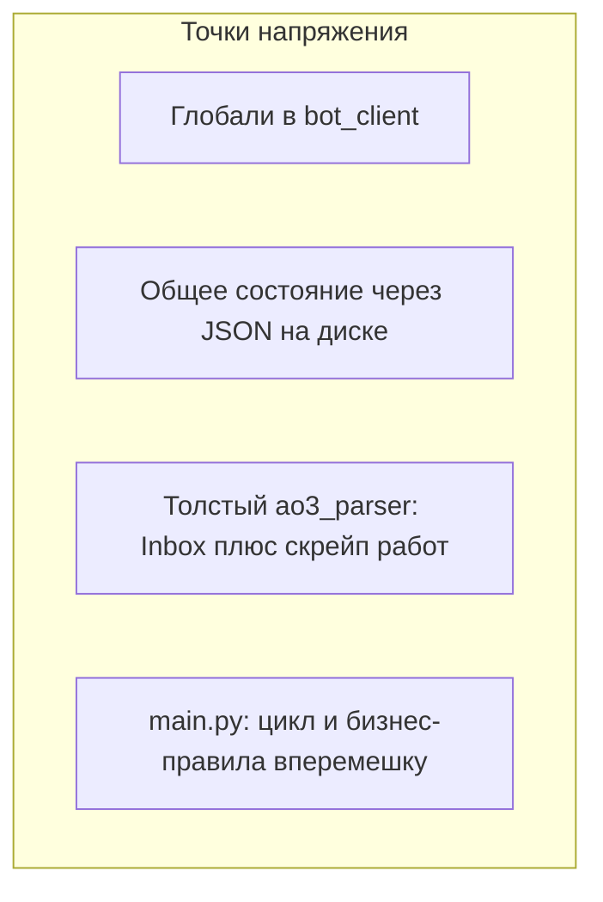
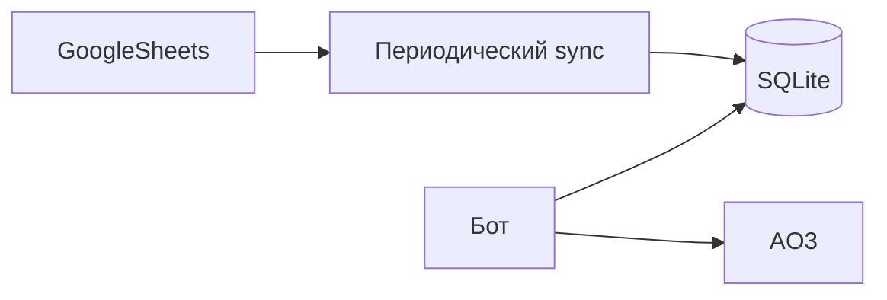

# Планируемая архитектура и функции (не внедрено)

Этот документ фиксирует **направление развития** и **рефакторинг**, которые пока **не реализованы в коде**. Актуальное поведение бота описано в [README.md](../README.md).

---

## Текущие ограничения кода

- В `bot_client.py` используются модульные глобали (`_bot`, `_state_file`, `_state_manager`) — усложняют тесты и явную сборку зависимостей.
- Состояние разделено между циклом AO3 и polling Telegram через файл `bot_state.json`; контракт владения состоянием не формализован.
- В `ao3_parser.py` смешаны Inbox и большой объём кода обхода работ/комментариев; из `main.py` для основного режима используется только Inbox.

---

## Варианты переработки архитектуры

### A — минимальная перестройка (разумный первый шаг)

1. Вынести Inbox в отдельный модуль (например `ao3_inbox.py`): сессия, загрузка, парсинг, retry.
2. Оставить обход работ в отдельном файле или удалить, если режим не нужен.
3. Убрать глобали в Telegram-слое: объект контекста и передача в `register_handlers`.
4. Вынести политику одного цикла (seed / уведомления / сохранение) из `main.py` в отдельную функцию или сервис.

### B — слои домена и портов

- Доменные типы и сервис «снимок Inbox + состояние → исходящие сообщения».
- Порты: `Ao3InboxPort`, `NotificationSink`, `StateRepository`; реализации подключаются в одной точке сборки.

### C — asyncio

- Один event loop: async Telegram + HTTP к AO3 через `aiohttp` или `asyncio.to_thread` для sync-библиотек.

### D — очередь исходящих сообщений

- Продьюсер (цикл Inbox) и воркер отправки в Telegram через очередь — удобно при многих топиках и лимитах API.

### Практическая рекомендация

- Для одного воркера на Railway чаще достаточно **A**.
- **B** — если появится общее состояние или несколько инстансов.
- **C + D** — при росте функциональности и нагрузки на отправку.

---

## Расширения продукта (будущее)

### Цели

1. Уведомления в Telegram о новых событиях из AO3 Inbox (база уже есть), с возможностью расширения типов уведомлений.
2. **Ответ автора на комментарий** под своей работой с **обязательной проверкой авторства** (работа принадлежит тому же AO3-аккаунту, что и сессия бота, плюс согласованность с реестром работ).
3. **Упоминание автора в Telegram**, когда под его работой оставили комментарий (чтобы нужный человек получил пинг).

### Данные: Google Sheets + SQLite на VPS

Задуманная схема данных:

- **Лист 1:** ссылка на работу AO3 (или `work_id`) + имя/ник автора.
- **Лист 2:** ник в Telegram + имя автора (как на листе 1).

На сервере — **SQLite** как локальный кэш после синхронизации с Sheets (не читать Sheets на каждое уведомление: квоты и задержка).

**Нагрузка:** конфигурация вроде 1 vCPU, 1 GB RAM, 15 GB диска для одного процесса бота + SQLite + периодического sync — **низкая**; ограничения чаще со стороны AO3/Telegram.

### Синхронизация таблицы: опрос (polling) vs сигнал из Google (push)

Сама таблица **не шлёт вебхуки наружу**; «узнать об изменении» можно двумя семействами подходов.

**Рекомендуется по умолчанию — периодический опрос (polling):**

- Раз в **5–15 минут** (интервал подобрать под терпимую задержку) загружать данные через **Google Sheets API** и обновлять SQLite.
- **Плюсы:** не нужен публичный HTTPS-приёмник у бота; совместимо с текущей моделью «один фоновый воркер»; проще деплой и безопасность.
- **Когда этого достаточно:** реестр работ и авторов меняется **реже**, чем поток комментариев AO3; задержка в несколько минут для привязки «работа → автор → Telegram» обычно приемлема.

**Опционально позже — лёгкий push из Google Apps Script:**

- В таблице: **Extensions → Apps Script**, триггер на изменение (например `onEdit` или устанавливаемый триггер «при изменении» — смотреть актуальные типы в документации Google).
- Скрипт вызывает **`UrlFetchApp.fetch`** и делает **POST** на ваш URL с минимальным телом: например «инвалидировать кэш» или «версия таблицы изменилась», **без передачи всей таблицы** и без секретов в открытом виде (использовать общий секрет в заголовке, ограничить IP если возможно).
- Сервер после сигнала выполняет **тот же полный импорт**, что и при polling (источник правды остаётся таблица).

**Плюсы push:** почти сразу подтягивать строки после правки; можно реже дергать Sheets API, если без сигнала пришлось бы опрашивать очень часто.

**Минусы push:** нужен **HTTP endpoint** (ещё один процесс или маршрут), TLS, защита от лишних запросов; квоты и ограничения Apps Script; иногда **дубли срабатываний** — обработка должна быть **идемпотентной**.

**Практическое правило:** начать с **polling**; добавить Apps Script **только если** задержка опроса реально мешает или нужно уменьшить частоту чтений большой таблицы.

### Проверка авторства перед ответом на AO3

1. **Реестр (лист 1 / SQLite):** по `work_id` найти автора; он должен совпадать с `AO3_USERNAME` сессии (нормализация имён зафиксировать в коде). Для соавторов — несколько имён или таблица `work_authors`.
2. **Проверка на AO3:** загрузить метаданные работы и убедиться, что список авторов на сайте содержит пользователя сессии (защита от ошибок в таблице).

При несоответствии — не отправлять ответ на AO3, сообщить в Telegram.

### UX ответа на комментарий

- Inline-кнопка «Ответить» с `work_id` и `parent_comment_id`, или команда + следующее сообщение как текст ответа (с таймаутом и проверкой пользователя).
- Право отвечать: связка листа 2 с `from_user.id` / @username и опционально белый список админов.

### Техника отправки ответа на AO3

- Проверить возможности **ao3_api**; при отсутствии метода — POST HTML-формы с `authenticity_token` при авторизованной сессии.

### Упоминание в Telegram

- Предпочтительно иметь **числовой `user_id`** (например после `/start` в ЛС боту) для ссылки `tg://user?id=...` в HTML.
- Если есть публичный @username во втором листе — можно использовать его в тексте (с учётом ограничений чата).

---

## Чеклист внедрения (когда решите делать)

Базовый рефакторинг:

- [ ] Вынести Inbox из `ao3_parser.py` в отдельный модуль.
- [ ] Заменить глобали в `bot_client` на контекст.
- [ ] Вынести логику одного цикла из `main.py`.
- [ ] Опционально: порты `StateRepository` / `NotificationSink`.
- [ ] Опционально: asyncio и очередь исходящих.

Расширения (Sheets, ответы, тэги):

- [ ] Модуль синхронизации Google Sheets → SQLite (по умолчанию **polling** 5–15 мин; опционально позже POST «invalidate» из Apps Script).
- [ ] Двухконтурная проверка авторства перед POST ответа.
- [ ] Упоминание автора в шаблоне уведомления из кэша.
- [ ] Реализация POST ответа на комментарий (ao3_api или формы).

---

## Связь с документом плана в Cursor

Детальный черновик того же содержания может находиться в системном файле плана Cursor (`ao3_bot_architecture`). Источник правды для репозитория при отсутствии внедрения — **этот файл**.
